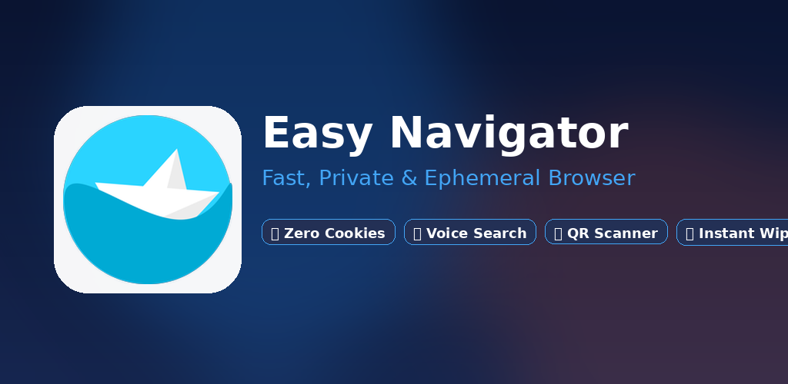
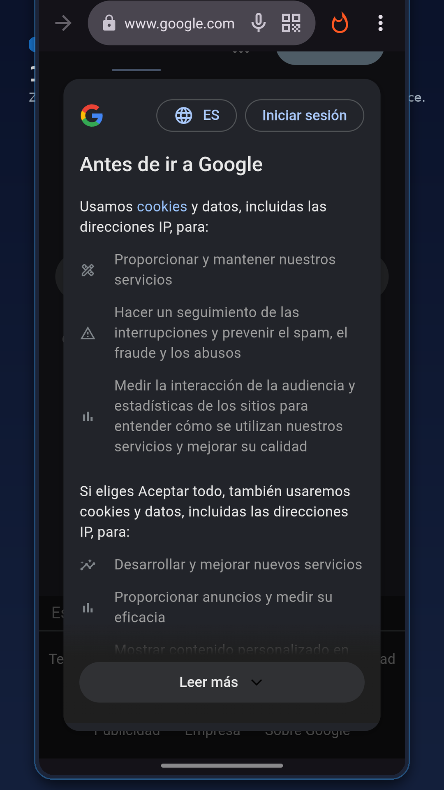
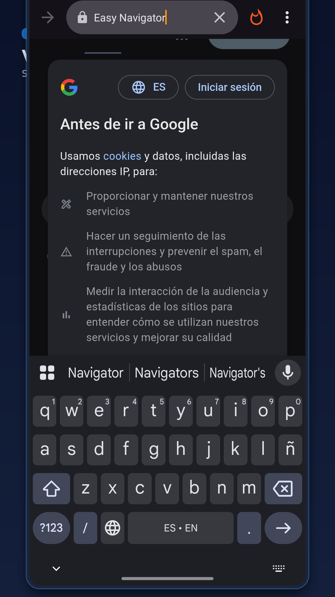
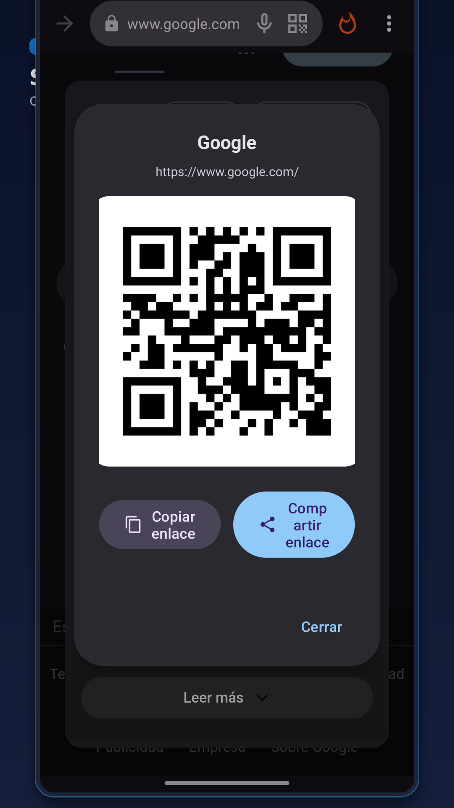
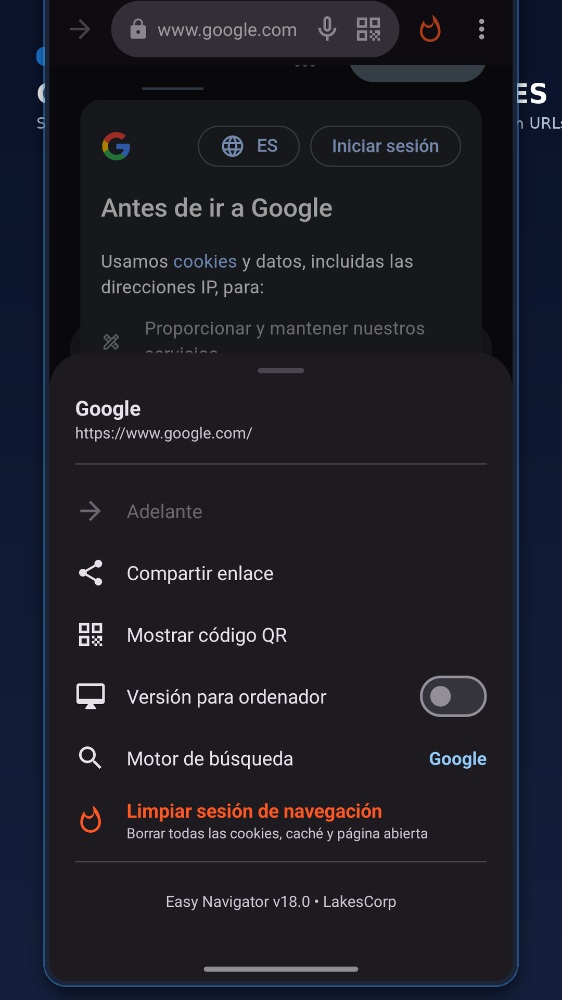
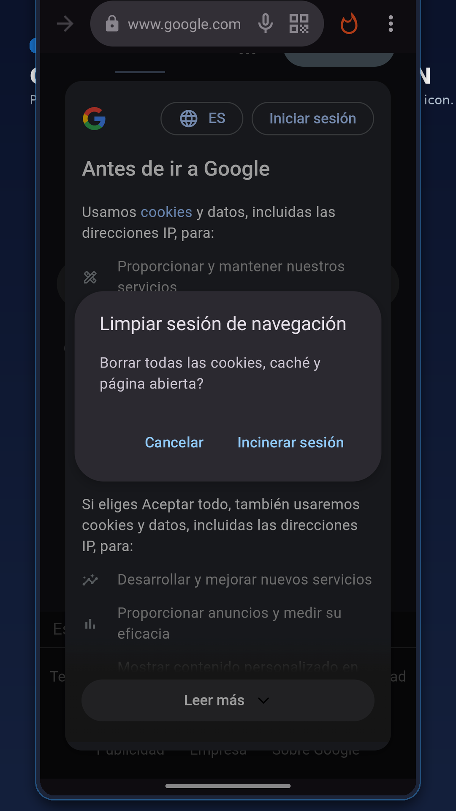

<p align="center">
  <br>
  <h1 align="center">Easy Navigator</h1>
  <p align="center"><b>Fast, lightweight, and strictly ephemeral web browsing for your daily workflow.</b></p>
</p>

<p align="center">
  <a href="https://play.google.com/store/apps/details?id=appinventor.ai_grmapal2.Navegator">
    
  </a>
</p>

<p align="center">
  <a href="LICENSE"></a>
  <a href="https://developer.android.com"></a>
  <a href="https://kotlinlang.org"></a>
  
</p>

---

## 🌟 What is Easy Navigator?

**Easy Navigator** is a lightweight, privacy-first web browser designed for anyone who wants to browse the internet quickly without intrusive tracking, persistent cookies, or endless history logs cluttering their device. Unlike conventional browsers that quietly store your passwords and track your activity across sessions, Easy Navigator operates in continuous ephemeral mode: the moment you exit the app or tap the quick wipe button, all session traces, cookies, and temporary caches vanish immediately.

It is the perfect companion for quick searches, opening links from messaging apps and social media, reading articles, and scanning QR codes cleanly without leaving digital footprints behind.

---

## ✨ Key Features (Designed for You)

- 🛡️ **True Ephemeral Privacy:** Browse with peace of mind. No persistent history, no saved credentials or form data, and zero local tracking on your mobile device.
- 🔥 **Instant Incinerate / Session Wipe:** Tap the fire icon at the top of the screen to purge open pages, cache, and cookies with a single touch.
- 🎙️ **Integrated Voice Search:** Avoid typing on small keyboards. Simply tap the microphone icon, speak your query, and view results instantly.
- 📷 **QR Code Scanner & Generator:**
  - **Scan:** Point your camera at any QR code (in restaurants, events, or posters) to navigate to the link immediately.
  - **Share:** Instantly generate an on-screen QR code of the webpage you are viewing so friends or colleagues can scan and open it on their devices.
- 🔍 **Customizable Search Engines:** Easily switch between Google, DuckDuckGo, Bing, Ecosia, or configure your own favorite custom search provider.
- ⚡ **Lightweight & Battery Friendly:** Opens instantly with minimal resource overhead, keeping your device fast and preserving battery life.
- 🖥️ **One-Tap Desktop Site:** Switch easily between mobile and full desktop view whenever a webpage requires larger layout rendering.
- 🔄 **Calibrated Pull-to-Refresh:** Smoothly reload webpages by dragging down without accidental triggers during regular scrolling.

---

## 📱 Screenshots & Showcase

<p align="center">
  
</p>

| 🏠 Home Screen | 🔍 Search & Voice | 📷 QR Code Share | ⚙️ Settings Menu | 🔥 Incinerate Session |
| :---: | :---: | :---: | :---: | :---: |
|  |  |  |  |  |

---

<details>
<summary><b>🛠️ Developer Guide & Technical Architecture (Click to expand)</b></summary>
<br>

### 🏗️ Architecture & Technologies

Easy Navigator is built with modern, native Android components adhering to current best practices:

- **Language:** Kotlin 2.0.20 targeting JVM 17.
- **Android SDK Targets:** `minSdk = 21` (Android 5.0 Lollipop), `compileSdk = 36` / `targetSdk = 36` (Android 16).
- **UI & Layout:** ViewBinding, AndroidX Edge-to-Edge (`enableEdgeToEdge`), Material Design 3 Components.
- **Privacy WebView Engine:** AndroidX WebKit (`androidx.webkit:webkit:1.12.1`) configured with strict isolation and zero disk persistence:
  - `cacheMode = LOAD_NO_CACHE`
  - `saveFormData = false`, `savePassword = false`
  - `geolocationEnabled = false`, `databaseEnabled = false`
  - `allowFileAccess = false`, `allowContentAccess = false`
  - `mixedContentMode = MIXED_CONTENT_NEVER_ALLOW`
  - Full purge of `CookieManager`, `WebStorage` (DOM/IndexedDB), and cache directories upon exit or explicit wipe.
- **QR Code Scanning & Generation:** ZXing Android Embedded (`zxing-android-embedded`) and ZXing Core (`zxing:core`).
- **Voice Recognition:** Native Android `SpeechRecognizer` via modern `ActivityResultContracts`.

### 📋 Prerequisites

- **JDK:** Java Development Kit 17 or later.
- **Android SDK:** Android SDK Build-Tools 36.0.0 and Platform API 36 installed.
- **Gradle:** Gradle 8.11.1 wrapper provided (`./gradlew`).

### 🚀 Local Build & Run Instructions

1. **Clone the repository:**
   ```bash
   git clone https://github.com/lagosproject/EasyNavigator.git
   cd EasyNavigator
   ```

2. **Configure local properties:**
   ```bash
   cp local.properties.example local.properties
   # Adjust sdk.dir if Android Studio / SDK is in a custom path
   ```

3. **Build Debug APK:**
   ```bash
   ./gradlew assembleDebug
   ```

4. **Install on a connected device or emulator:**
   ```bash
   ./gradlew installDebug
   ```

5. **Build Release APK / AAB:**
   Configure your signing credentials via environment variables or `keystore.properties`:
   ```bash
   cp keystore.properties.example keystore.properties
   # Or export KEYSTORE_PATH, KEYSTORE_PASSWORD, KEY_ALIAS, KEY_PASSWORD
   ./gradlew assembleRelease
   ```

### 🤖 Automation Scripts

The repository includes helper scripts inside `screenshots_automation/`:
- `capture_device_screens.sh`: Automated ADB script for capturing device screens across key user flows.
- `generate_showcase.py`: Python Pillow pipeline that produces localized store cards for Phone, 7" Tablet, 10" Tablet, and Feature Banners across 4 locales (`en-US`, `es-ES`, `fr-FR`, `pt-PT`).
- `upload_playstore_metadata.py`: Automated Google Play Developer API publisher for store listings and graphical assets.

</details>

---

## 🤝 Contributing

Contributions are welcome! If you would like to report a bug, suggest an improvement, or submit code:
1. Please read our [Contributing Guidelines](CONTRIBUTING.md).
2. Review our [Security Policy](SECURITY.md) for reporting privacy or security vulnerabilities.
3. Open an Issue or submit a Pull Request following Conventional Commits.

---

## 📄 License

This project is licensed under the **MIT License**. See the [LICENSE](LICENSE) file for details.

Developed and maintained with ❤️ by **[lagosproject](https://github.com/lagosproject)**.
